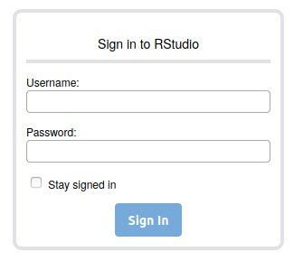

# Bio-M2_E02 | Functional genomic data analysis : transcriptomics | Practical

- [1. Practical content](#content)
- [2. Connect to the IFB server](#logging)
- [3. Connect to the IFB Rstudio server](#rstudio)

## Practical Transcriptomic analysis <a name="content"></a>

[TD Microarrays](./TD_Microarrays/README.md)

[TD RNAseq](./TD_RNAseq/TD_RNAseq.md)

## Connect to the IFB server <a name="logging"></a>

For this part of the practical, you will work remotely on the [IFB-core cluster](https://www.france-bioinformatique.fr/le-cluster-ifb-core/) located in **Orsay (IDRIS)**. Because it it a shared infrastructure you will have to pay attention to the command you use to start a job. **They all must start with *srun***.  
You can refer to [IFB Core Cluster Documentation](https://ifb-elixirfr.gitlab.io/cluster/doc/) for more detail about logging, data management, job submission. 

#### Sign in on the server
  * On Windows using [MobaXterm](https://mobaxterm.mobatek.net/)
  
> 1. In **Session** > **SSH**  
> Remote Host : core.cluster.france-bioinformatique.fr  
> Specify username : ticked and filled in **your login**
> Advanced SSH settings : tick X11-Forwarding  
> 2. Enter your password
> 3. You should be logged on the IFB Core cluster 

<p align="center">


</p>

  * On MacOS and Linux using a terminal window
```bash
ssh <login>@core.cluster.france-bioinformatique.fr
```

## Connect to the IFB Rstudio server <a name="rstudio"></a>

In a web browser, connect to https://rstudio.cluster.france-bioinformatique.fr/auth-sign-in and log in using your user name and password (same as for ssh connection)

<p align="center">



</p>

You will reached the familiar Rstudio environment:

<p align="center">


</p>
