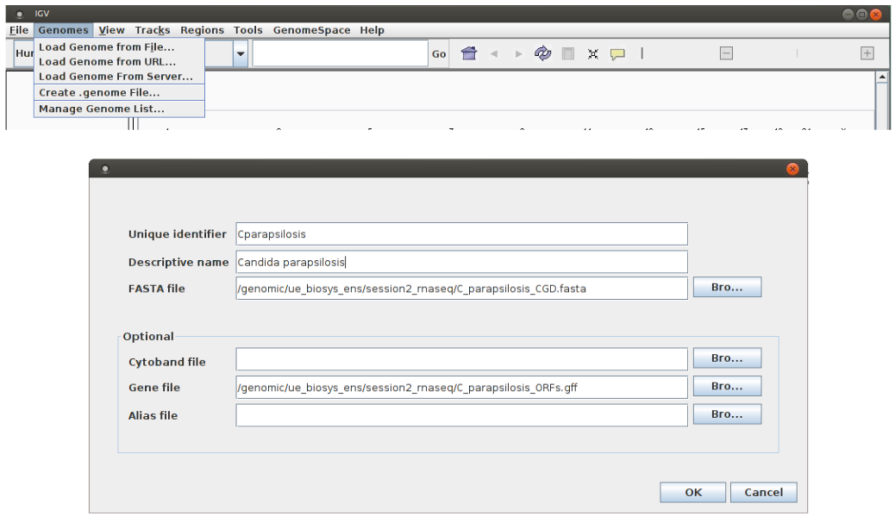
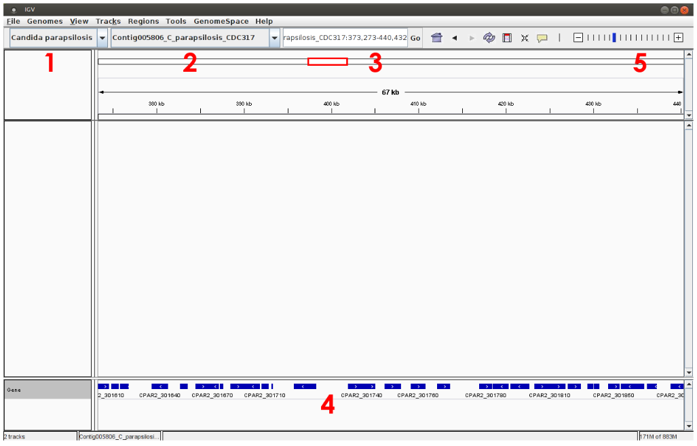
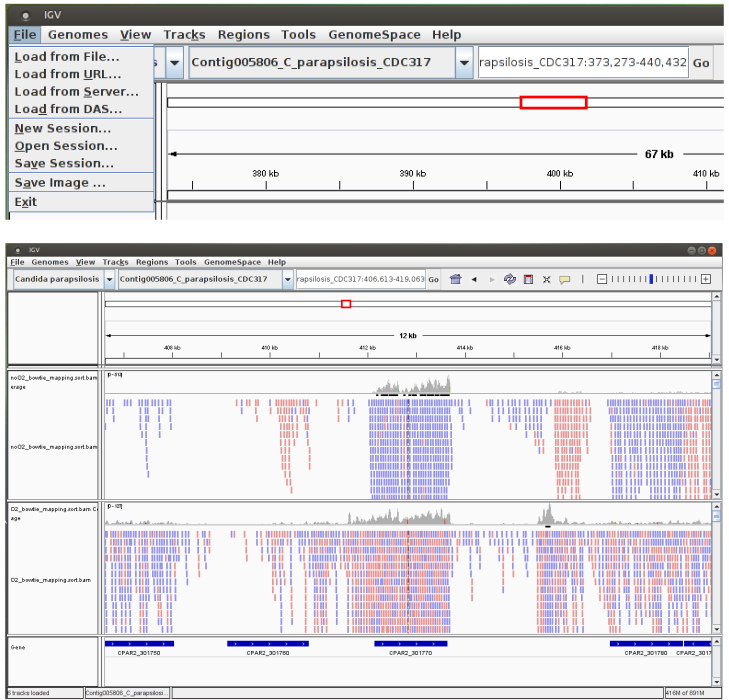
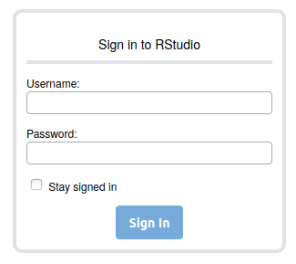
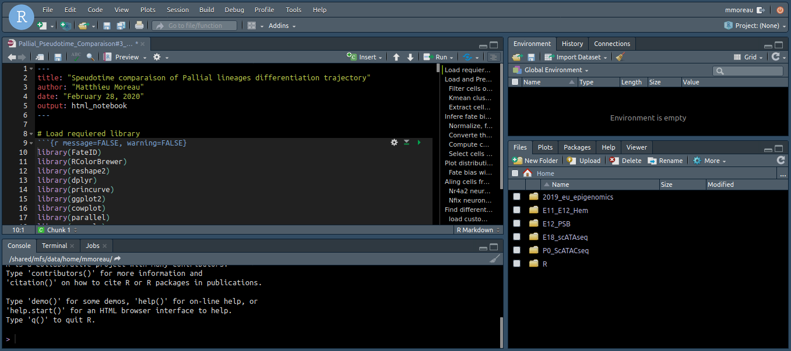

# Practical training – RNA-seq data analysis


- [1. Introduction](#intro)
- [2. Connect to the server and set up your working environment](#logging)
- [3. Sequence Quality Controls](#QC)
- [4. Mapping of Reads on the Reference Genome](#mapping)
- [5. Alignments Visualization with a Genome Browser](#genome_browser)
- [6. Search for Differentially Expressed Genes](#DEtest)
- [7. Usefull commands to work on the cluster](#Troubleshooting)


#

## Introdution <a name="intro"></a>

#

### Objective of this practical session:

During this practical session, you will learn:

  * To conduct an analysis of RNA-seq raw fastq files. You will first perform **quality control** of the sequencing file before proceding to the **mapping** of the reads on the reference transcriptome.

  * To perform statistical analysis of the gene expression matrices in order to identify differentialy expressed genes between two conditions
 

### Dataset used :

Data used in these practical were collected from the following publication:

>Guida, A., Lindstädt, C., Maguire, S. L., Ding, C., Higgins, D. G., Corton, N. J., Berriman, M., et al. (2011). Using RNA-seq to determine the transcriptional landscape and the hypoxic response of the pathogenic yeast *Candida parapsilosis*. BMC genomics
>[Guida *et al*. BMC Genomics 2011 ](https://bmcgenomics.biomedcentral.com/articles/10.1186/1471-2164-12-628)

#

## Connect to the server and set up your working environment<a name="logging"></a>

For this part of the practical, you will work remotely on the [IFB-core cluster](https://www.france-bioinformatique.fr/le-cluster-ifb-core/) located in **Orsay (IDRIS)**. Because it it a shared infrastructure you will have to pay attention to the command you use to start a job. **They all must start with *srun***.  
You can refer to [IFB Core Cluster Documentation](https://ifb-elixirfr.gitlab.io/cluster/doc/) for more detail about logging, data management, job submission. 

#

#### 1 - Sign in on the server
  * On Windows using [MobaXterm](https://mobaxterm.mobatek.net/)
  
> 1. In **Session** > **SSH**  
> Remote Host : core.cluster.france-bioinformatique.fr  
> Specify username : ticked and filled in **your login**
> Advanced SSH settings : tick X11-Forwarding  
> 2. Enter your passwork
> 3. You should be logged on the IFB Core cluster 

<p align="center">


</p>

  * On MacOS and Linux
```bash
ssh <login>@core.cluster.france-bioinformatique.fr
```

#### 2 - Set up your working environment
1. Go to your home directory
```bash
cd 
```
2. Create a directory that will contain all results of the upcoming analyses.
```bash
mkdir RNAseq
```
3. Go to the newly created directory
```bash
cd RNAseq
```

4. Check your are in the right directory using `pwd`:

```bash
pwd

/shared/home/<your login>/RNAseq
```

#

## Sequence Quality Controls <a name="QC"></a>

#

**Fastq** files are raw results from RNA-seq experiments. These files comprise all the **sequences** (or reads) obtained with the sequencer machine (Illumina technology here), together with **base quality scores** (PHRED scores).

Two different files will be analyzed in this practical (see [Guida *et al*.](https://bmcgenomics.biomedcentral.com/articles/10.1186/1471-2164-12-628) for more information) :
- ***O2rep2_SRR352263.fastq*** refereed to a transcriptome analysis of yeasts *C. parapsilosis* under normoxic condition.
- ***noO2rep3_SRR352271.fastq*** refereed to a transcriptome analysis of yeasts *C. parapsilosis* under hypoxic condition 

In a first step, quality controls will be perform on each FASTQ files in order to evaluate the quality of the sequences and identify potential problems that could impact the following analyses. Dedicated JAVA software will be used : [**FastQC 0.11.8**](http://www.bioinformatics.babraham.ac.uk/projects/fastqc/) . Note that other software exists.

FastQC is a quality control application for high throughput sequence data. It provides an interactive application to review the results of several different quality control checks, and create an **HTML based report**. The main functions of FastQC are:

>  - **Import of data** from BAM, SAM or FastQ files (any variant)
>   - Providing a **quick overview** to tell you in which areas there may be problems
>   - **Summary graphs** and tables to quickly assess your data
>   - Export of results to an **HTML based permanent report**
>   - **Offline operation** to allow automated generation of reports without running the interactive application

####  :heavy_exclamation_mark: TO DO: Use FASTQC to evaluate the quality of sequences in each FASTQ files. Using information from the [Fastqc help page](http://www.bioinformatics.babraham.ac.uk/projects/fastqc/Help) as well as exemples of [good](http://www.bioinformatics.babraham.ac.uk/projects/fastqc/good_sequence_short_fastqc.html)  and [bad](http://www.bioinformatics.babraham.ac.uk/projects/fastqc/bad_sequence_fastqc.html) illumina data as references, compare results between the two FASTQ files. Is there any concern related to the following analyses? :heavy_exclamation_mark:

1. Create a new directory to store the output of fastqc

```bash
mkdir 1-QualityControl
```
Using the `tree` command, your directory should look like this :

```bash
/shared/home/<your login>/RNAseq
│
└───1-QualityControl
```

2. Go to this directory

```bash
cd 1-QualityControl
```
3. Get Fastqc available in your environment

```bash
module load fastqc/0.11.8
```

4. Check the help page of the programme to see its usage and parameters 

```bash
srun fastqc --help
```

5. Run fastqc on each experiment files

- /shared/projects/ens_hts_2020/data/rnaseq/O2rep2_SRR352263.fastq : **absolute path** to the first file
- -o: creates all output files in the specified output directory. '.' means current directory.

```bash
# O2 condition reads
srun fastqc /shared/projects/ens_hts_2020/data/rnaseq/O2rep2_SRR352263.fastq -o .
```
```bash
# noO2 condition reads
srun fastqc /shared/projects/ens_hts_2020/data/rnaseq/noO2rep3_SRR352271.fastq -o .
```
At this point you should see the two new files in your directory using the `tree` command

```bash
/shared/home/<your login>/RNAseq
│
└───1-QualityControl
	└─── O2rep2_SRR352263.fastqc.html
	└─── O2rep2_SRR352263.fastqc.zip
	└─── noO2rep3_SRR352271.fastqc.html
	└─── noO2rep3_SRR352271.fastqc.zip
```
6. Download the HTML file reports on your local machine

```bash
### OPEN A NEW TERMINAL
## Create a directory where to put generated files on your computer
mkdir ~/Desktop/RNAseq/

## Go to the location on your computer, where you want to put the data, for example:
cd ~/Desktop/RNAseq/

## Download html report files
scp <login>@core.cluster.france-bioinformatique.fr:~/RNAseq/1-QualityControl/*.html .
# Enter your password 
```

7. Open the *.html* report with your favorite browser


#

## Mapping of Reads on the Reference Genome <a name="mapping"></a>

#

Once data quality is verified, reads will be mapped onto the reference genome of yeast *C. parapsilosis*. The **genome sequence** of *C. parapsilosis* and its **annotations** (locations of ORFs) were retrieved from the [CGD database](http://www.candidagenome.org/ "Candidat genome database").

Different aligner and algorithms for RNA-seq analysis exist. We will use [**Bowtie 1.2.2**](http://bowtie-bio.sourceforge.net/manual.shtml)  an ultrafast (memory-efficient) short read aligner. As an input, Bowtie uses a **Fastq file** (with reads to be aligned) and **“pre-built indexes”** of the reference genome. These indexes are named ***“C_parapsilosis.1.ebwt”***, ***“C_parapsilosis.2.ebwt”***, etc. They will allow boosting the alignment process.  
As an output, Bowtie provides a **SAM file**. SAM (Sequence Alignment/Map) is a generic format for storing large nucleotide sequence alignments.

#### :heavy_exclamation_mark: TO DO : Run sequence alignments with Bowtie using the two FASTQ files. Take a look at Bowtie documentation and describe the specified options (*-m* in particular). What is the proportion of reads aligned on the reference genome? :heavy_exclamation_mark:

1. Create a new directory to store the output of fastqc

```bash
#Go to the parental directory "RNAseq"
cd ../

#Create a new directory to store results of the alignment
mkdir 2-Mapping
```
Your directory should now look like this :

```bash
/shared/home/<your login>/RNAseq
│
└───1-QualityControl
	└─── O2rep2_SRR352263.fastqc.html
	└─── O2rep2_SRR352263.fastqc.zip
	└─── noO2rep3_SRR352271.fastqc.html
	└─── noO2rep3_SRR352271.fastqc.zip
└─── 2-Mapping
```

2. Go to this directory

```bash
cd 2-Mapping
```
3. Load Bowtie into your environment

```bash
module load bowtie/1.2.2
```

4. Map the reads to the reference genome

>- **-S** will output the result in SAM format
>- **/shared/projects/ens_hts_2020/data/rnaseq/bowtie_indexes/C_parapsilosis** specify the location and the **prefix (C_parapsilosis)** of the bowtie's index files
>- **/shared/projects/ens_hts_2020/data/rnaseq/Fastqc/O2rep2_SRR352263.fastq.gz** location of the input fastq
>- **2>** will print some statistic about the aligment (#of reads mapped, etc...)
>- **>** redirects the mapping output into a .sam file

```bash
# Map the aerobic condition reads
srun bowtie -S /shared/projects/ens_hts_2020/data/rnaseq/bowtie_indexes/C_parapsilosis \
	/shared/projects/ens_hts_2020/data/rnaseq/O2rep2_SRR352263.fastq 2> O2rep2_SRR352263_bowtie_mapping.out > O2rep2_SRR352263_bowtie_mapping.sam
```

```bash
# Map the hypoxic condition reads
srun bowtie -S /shared/projects/ens_hts_2020/data/rnaseq/bowtie_indexes/C_parapsilosis \
 	/shared/projects/ens_hts_2020/data/rnaseq/noO2rep3_SRR352271.fastq 2> noO2rep3_SRR352271_bowtie_mapping.out > noO2rep3_SRR352271_bowtie_mapping.sam
```

Your directory should now look like this :

```bash
/shared/home/<your login>/RNAseq
│
└───1-QualityControl
	└─── O2rep2_SRR352263.fastqc.html
	└─── O2rep2_SRR352263.fastqc.zip
	└─── noO2rep3_SRR352271.fastqc.html
	└─── noO2rep3_SRR352271.fastqc.zip
└─── 2-Mapping
	└─── O2rep2_SRR352263_bowtie_mapping.sam
	└─── O2rep2_SRR352263_bowtie_mapping.out
	└─── noO2rep3_SRR352271_bowtie_mapping.sam
	└─── noO2rep3_SRR352271_bowtie_mapping.out
```

#

## Alignments Visualization with a Genome Browser <a name="genome_browser"></a>

#

The [Integrative Genomics Viewer](http://software.broadinstitute.org/software/igv/home) (IGV) is a high-performance **visualization tool** for interactive exploration of large, integrated genomic datasets. It supports a wide variety of data types, including array-based, next-generation sequence data and genomic annotations. In this practical, we will use IGV to visualize mapping results (see previous section). For that, **SAM files** has to be converted into **BAM files** (a binary version of SAM) and “sorted” according to the genomic sequence. We will use programs available in the [**Samtools 1.9**](http://samtools.sourceforge.net/) suite.

#### :heavy_exclamation_mark: TO DO : Run the conversion of SAM files (obtain with BOWTIE) into BAM files and “sorted and indexed” BAM files. Run IGV. :heavy_exclamation_mark:

1. Sort and Converte *.sam* into *.bam* files

>- **samtools sort** Sort alignments by genomic coordinates
> - **|** "pipe" the output of samtools sort to the next programme i.e. samtools view
> - **samtools view** will convert sam into bam
> - **-b** specify the output to be in BAM format
>- **>** write the output in the bam file

```bash
module load samtools/1.9
```

```bash
# Sort and convert O2 condition
srun samtools sort O2rep2_SRR352263_bowtie_mapping.sam | srun samtools view -b  > O2rep2_SRR352263_bowtie_sorted.bam

# Sort and convert noO2 condition
srun samtools sort noO2rep3_SRR352271_bowtie_mapping.sam | srun samtools view -b  > noO2rep3_SRR352271_bowtie_sorted.bam
```
2. Create an index of the tow bam files

> IGV requieres the to have an index of the bam file. The index of a bam file is name ***.bam.bai***

```bash
#Index the O2 condition
srun samtools index O2rep2_SRR352263_bowtie_sorted.bam

#Index the noO2 condition
srun samtools index noO2rep3_SRR352271_bowtie_sorted.bam
```
3. Download the resulting bam and index files on your computer

```bash
# To download the bam files from the cluster to your current directory (on your own computer), **open a new shell and run**

scp  <your login>@core.cluster.france-bioinformatique.fr:~/RNAseq/2-Mapping/*.bam* .
```
You will also need the reference genome sequence and gene annotation files

```bash
# To download the bam files from the cluster to your current directory (on your own computer), **open a new shell and run**

scp  <your login>@core.cluster.france-bioinformatique.fr:/shared/projects/ens_hts_2020/data/rnaseq/C_parapsilosis_CGD.fasta .

scp  <your login>@core.cluster.france-bioinformatique.fr:/shared/projects/ens_hts_2020/data/rnaseq/C_parapsilosis_ORFs.gff .
```

4. Visualize mapping results with IGV

> Download [IGV](http://software.broadinstitute.org/software/igv/download) and follow the instalation instructions according to your OS

Once the IGV program is launched, it is necessary to **import the reference genome** “Genomes/Create .genome File...” (see below). Select the FASTA file with the genomic sequence of *C. parapsilosis* “C_parapsilosis_CGD.fasta” (“Browse / FASTA file”) and **enter information regarding ORFs positions**, GFF file “C_parapsilosis_ORFs.gff” (“Browse Gene file”).  
Finally, give a name to your genome (“Unique identifier” and “Descriptive name”) and press “OK”. Save the genome file in your home.  
**Warning!** In order to IGV to create a index of your genome, you need to copy the reference genome FASTA file in writable directory.


<p align="center">



</p>

*C. parapsilosis* genome is now loaded into IGV and can be selected from the top/left menu (see 1 below). The genomic sequence can be therefore explored, choosing for instance, a particular chromosome (see 2 below) or a genomic region (see 3). Note that gene annotations (ORF positions) are shown on the bottom of the window (see 4, blue lines) and you can obtain a more detailed view of the sequence using the cursor located on the top/right of the window, see 5).

<p align="center">



</p>

Mapping results (“.sorted.bam” files) can now be imported (“File / Load from File”):

<p align="center">



</p>

#### :heavy_exclamation_mark: TO DO : Compare your results with those presented in the original publication: Did the authors use stranded-specific protocols? Can you observe differences between hypoxic and normoxic conditions? :heavy_exclamation_mark:


#

## Search for Differentially Expressed Genes <a name="DEtest"></a>

#

### Gene counts estimation

To identify genes whose expression is different between hypoxic and normoxic conditions, we will **count and compare the number of reads mapped to each ORF**. A program available in the [**Bedtools 2.27.1**]( https://github.com/arq5x/bedtools2/blob/master/README.md) suite will be used.

#### :heavy_exclamation_mark: TO DO : Calculate for each ORF the number of reads that were aligned (normoxic and hypoxic conditions). :heavy_exclamation_mark:

1. Create a new directory to store the ORF count matrix

```bash
#Go to the parental directory "RNAseq"
cd ../

#Create a new directory to store results of the alignment
mkdir 3-ORF_reads_count
```
Your directory should now look like this :

```bash
/shared/home/<your login>/RNAseq
├── 1-QualityControl
│   ├── noO2rep3_SRR352271_fastqc.html
│   ├── noO2rep3_SRR352271_fastqc.zip
│   ├── O2rep2_SRR352263_fastqc.html
│   └── O2rep2_SRR352263_fastqc.zip
├── 2-Mapping
│   ├── noO2rep3_SRR352271_bowtie_mapping.out
│   ├── noO2rep3_SRR352271_bowtie_mapping.sam
│   ├── noO2rep3_SRR352271_bowtie_sorted.bam
│   ├── noO2rep3_SRR352271_bowtie_sorted.bam.bai
│   ├── O2rep2_SRR352263_bowtie_mapping.out
│   ├── O2rep2_SRR352263_bowtie_mapping.sam
│   ├── O2rep2_SRR352263_bowtie_sorted.bam
│   └── O2rep2_SRR352263_bowtie_sorted.bam.bai
└── 3-ORF_reads_count
```

2. Go to this directory

```bash
cd  3-ORF_reads_count
```

3. Calculate for each ORF the number of reads that were aligned to it

```bash
module load bedtools/2.27.1
```

```bash
srun bedtools multicov -bams ../2-Mapping/O2rep2_SRR352263_bowtie_sorted.bam \
-bed /shared/projects/ens_hts_2020/data/rnaseq/C_parapsilosis_ORFs.gff > O2rep2_SRR352263_gene_counts.gff

srun sed 's/^.*ID=//' O2rep2_SRR352263_gene_counts.gff > O2rep2_SRR352263_gene_counts.tab
```

```bash
srun bedtools multicov -bams ../2-Mapping/noO2rep3_SRR352271_bowtie_sorted.bam \
-bed /shared/projects/ens_hts_2020/data/rnaseq/C_parapsilosis_ORFs.gff > noO2rep3_SRR352271_gene_counts.gff

srun sed 's/^.*ID=//' noO2rep3_SRR352271_gene_counts.gff > noO2rep3_SRR352271_gene_counts.tab
```

Take a look at the product files to see how the count files are organised

At the end of RNA-seq data analysis your directory should like this :

```bash
├── 1-QualityControl
│   ├── noO2rep3_SRR352271_fastqc.html
│   ├── noO2rep3_SRR352271_fastqc.zip
│   ├── O2rep2_SRR352263_fastqc.html
│   └── O2rep2_SRR352263_fastqc.zip
├── 2-Mapping
│   ├── noO2rep3_SRR352271_bowtie_mapping.out
│   ├── noO2rep3_SRR352271_bowtie_mapping.sam
│   ├── noO2rep3_SRR352271_bowtie_sorted.bam
│   ├── noO2rep3_SRR352271_bowtie_sorted.bam.bai
│   ├── O2rep2_SRR352263_bowtie_mapping.out
│   ├── O2rep2_SRR352263_bowtie_mapping.sam
│   ├── O2rep2_SRR352263_bowtie_sorted.bam
│   └── O2rep2_SRR352263_bowtie_sorted.bam.bai
└── 3-ORF_reads_count
    ├── noO2rep3_SRR352271_gene_counts.gff
    ├── noO2rep3_SRR352271_gene_counts.tab
    ├── O2rep2_SRR352263_gene_counts.gff
    └── O2rep2_SRR352263_gene_counts.tab
```

4. Unload the tools you used

```bash
module unload samtools/1.9 bowtie/1.2.2 bedtools/2.27.1
```

### Statistical analysis using DEseq2 R package
In their article (Guida et al., 2011), the authors repeated the experiment 6 times for normoxic condition (with O2) and 4 times for hypoxic conditions (without O2). Results obtained for all experiments are combined in the file “/shared/projects/2020_eu_HTSdataAnalysis/rnaseq/count_data_diffAnalysis.txt”. This file will be used to search for differentially expressed genes using the **DESeq2** ([Love *et al*. 2014](https://genomebiology.biomedcentral.com/articles/10.1186/s13059-014-0550-8)) R package. The [DESeq package](http://www.bioconductor.org/packages/release/bioc/html/DESeq2.html) provides methods to test for differential expression by use of the negative binonial distribution and a shrinkage estimator for the distribution’s variance.

#### :heavy_exclamation_mark: TO DO : Search for differentially expressed genes using DESeq R package. How many genes are selected with different p-value thresholds (5%, 1%, etc.)? Check your results with IGV and use GOtermFinder (see practical on microarrays) to analyse the function of the selected genes. :heavy_exclamation_mark:

1. Connect to Rstudio serveur of the IFB

In a web browser, connect to https://rstudio.cluster.france-bioinformatique.fr/auth-sign-in and log in using your user name and password (same as for ssh connection)

<p align="center">



</p>


You will reached the familiar Rstudio environment :

<p align="center">



</p>

2. Save the working notebook containing all the code in your personal environment

    * In *File > Open File...* enter the path ***/shared/projects/ens_hts_2020/data/rnaseq/DEseq2.Rmd*** to open the notebook containing all the code needed for the practical.  
    * Save it into your personal folder using *File > Save As* 

3. Using your notebook, follow the [online tutorial](https://matthieumoreau06.github.io/HTS_M2-IMaLiS_2020/TD_RNAseq/Tutorial_DEseq2.html) to conduct the DE analysis

----

#

## Usefull commands to work on the cluster <a name="Troubleshooting"></a>

#

These are some usefull command lines you may need to work on the cluster

You can find more detailed information and video tutorial here [IFB Core Cluster Documentation](https://ifb-elixirfr.gitlab.io/cluster/doc/) 

1. How to download/upload your data from the cluster :

```bash
# To download file/files from the cluster to your current directory
scp  <your login>@core.cluster.france-bioinformatique.fr:/<absolute path to your file> 

# To download a folder from the cluster to your current directory
 scp -r  <your login>@core.cluster.france-bioinformatique.fr:/<absolute path to your folder>
 
# To upload a file to the cluster
 scp <path to your local folder> <your login>@core.cluster.france-bioinformatique.fr:/<absolute path to the target folder>
```

2. To have information on your current job :

```bash
squeue -u <your login>
```
3. To list all your running/pending jobs :

```bash
squeue -u <your login> -t RUNNING

squeue -u <your login> -t PENDING
```

4. To cancel/stop a job :

```bash
scancel <jobid>
```

5. To cancel all yout jobs:

```bash
scancel -u <your login>
```

6. To cancel all your pending jobs :

```bash
scancel -t PENDING -u <your login>
```
